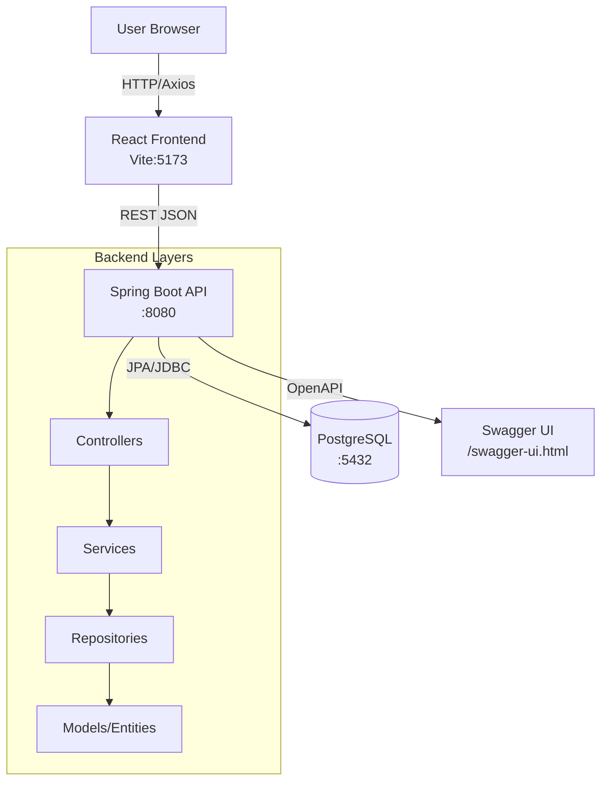

# 🏗️ System Architecture — MedLocator Platform

## Overview

The MedLocator Platform follows a **3-tier architecture** with a clear separation between presentation (React), application logic (Spring Boot), and data storage (PostgreSQL).

```
┌─────────────────────────────────────────────────────┐
│                     CLIENT LAYER                     │
│          React 18 + Vite + TailwindCSS               │
│   HomePage │ Search │ Details │ Booking │ My Appts   │
└──────────────────────┬──────────────────────────────┘
                       │ HTTPS / REST (JSON)
                       │ Axios HTTP Client
┌──────────────────────▼──────────────────────────────┐
│                  APPLICATION LAYER                   │
│             Spring Boot 3 (Port 8080)                │
│  ┌──────────┐ ┌──────────┐ ┌──────────┐             │
│  │Controller│→│ Service  │→│Repository│             │
│  └──────────┘ └──────────┘ └──────────┘             │
│       REST API            Business Logic   JPA/ORM   │
└──────────────────────┬──────────────────────────────┘
                       │ JDBC / JPA
┌──────────────────────▼──────────────────────────────┐
│                    DATA LAYER                        │
│                  PostgreSQL 15                       │
│    users │ clinics │ doctors │ appointments           │
└─────────────────────────────────────────────────────┘
```

---

## Component Descriptions

### Frontend (React + Vite)
- Single-page application (SPA) served from a CDN or static host
- Communicates with the backend exclusively via REST APIs
- State managed locally with React hooks (useState, useEffect)
- React Router for client-side navigation between pages
- Axios for all HTTP communication with the backend

### Backend (Spring Boot)
- Stateless REST API server
- Layered architecture: **Controller → Service → Repository → Model**
- **Controller** — handles HTTP routing, request validation, response formatting
- **Service** — business logic, orchestration
- **Repository** — data access using Spring Data JPA
- **Model** — JPA entities mapped to DB tables
- **Config** — CORS policy, OpenAPI/Swagger, datasource settings

### Database (PostgreSQL)
- Relational database storing all persistent data
- JPA/Hibernate manages schema (DDL auto-update in dev, Flyway migrations in prod)
- Indexed on frequently queried fields (`clinic.name`, `clinic.specialization`, `appointment.user_id`)

---

## Frontend–Backend Communication

| Concern | Approach |
|---|---|
| Protocol | HTTP/REST (JSON) |
| Auth | JWT Bearer tokens (future phase) |
| CORS | Configured in Spring Boot `CorsConfig` |
| Error Handling | HTTP status codes + JSON error body `{code, message}` |
| API Base URL | `http://localhost:8080` (dev), env-var in prod |

---

## API Design Approach

- **RESTful resource-based URLs** — nouns, not verbs
- **Standard HTTP verbs** — GET (read), POST (create), PUT (update), DELETE (remove)
- **Consistent JSON responses** following a shared response envelope where appropriate
- **Pagination** on list endpoints via `?page=&size=` query params (Spring Pageable)
- **Search** via query parameter: `GET /clinics/search?q={term}`
- **OpenAPI 3** documentation auto-generated via springdoc-openapi

---

## Database Design Strategy

- **Normalized** relational schema (3NF)
- Foreign key relationships enforced at DB level
- `doctors.clinic_id` → `clinics.id` (many doctors per clinic)
- `appointments.user_id` → `users.id`
- `appointments.clinic_id` → `clinics.id`
- `appointments.doctor_id` → `doctors.id`
- Audit fields (`created_at`, `updated_at`) on all entities
- Status enum on `appointments`: `PENDING`, `CONFIRMED`, `CANCELLED`, `COMPLETED`

---

## Scalability Considerations

| Concern | Strategy |
|---|---|
| Horizontal scaling | Stateless backend — multiple instances behind a load balancer |
| DB connection pooling | HikariCP (Spring Boot default) |
| Caching | Redis for clinic listings (future phase) |
| Search at scale | Elasticsearch for full-text clinic search (future phase) |
| Frontend CDN | Deploy static React build to S3/CloudFront or Vercel |
| API versioning | URL prefixing: `/api/v1/...` |
| Async processing | Spring @Async or message queue (Kafka) for appointment notifications |
| Containerisation | Docker + Docker Compose for local dev, Kubernetes for prod |

---

## Mermaid System Diagram


