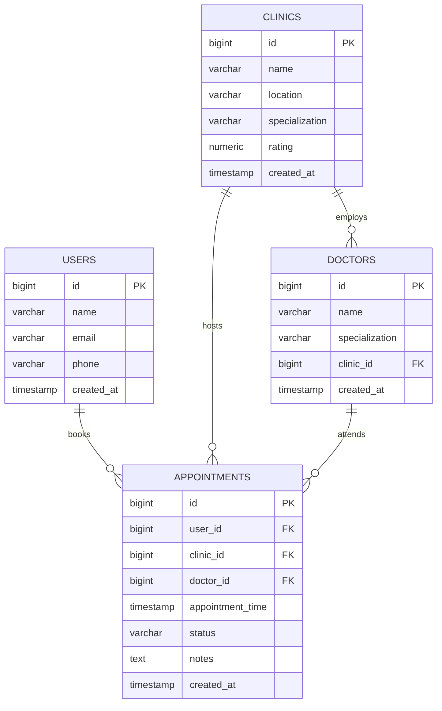

# 🗄️ Database Schema — Clinic AI Platform

## Tables Overview

| Table | Description |
|---|---|
| `users` | Platform users who search and book appointments |
| `clinics` | Registered clinics available for booking |
| `doctors` | Doctors associated with clinics |
| `appointments` | Appointment bookings linking users, clinics, and doctors |

---

## Table Definitions

### `users`

| Column | Type | Constraints | Description |
|---|---|---|---|
| `id` | `BIGSERIAL` | PK | Auto-increment primary key |
| `name` | `VARCHAR(150)` | NOT NULL | Full name of the user |
| `email` | `VARCHAR(255)` | NOT NULL, UNIQUE | Login / contact email |
| `phone` | `VARCHAR(20)` | | Phone number |
| `created_at` | `TIMESTAMP` | NOT NULL, DEFAULT NOW() | Record creation time |
| `updated_at` | `TIMESTAMP` | NOT NULL, DEFAULT NOW() | Last update time |

```sql
CREATE TABLE users (
    id         BIGSERIAL PRIMARY KEY,
    name       VARCHAR(150) NOT NULL,
    email      VARCHAR(255) NOT NULL UNIQUE,
    phone      VARCHAR(20),
    created_at TIMESTAMP    NOT NULL DEFAULT NOW(),
    updated_at TIMESTAMP    NOT NULL DEFAULT NOW()
);
```

---

### `clinics`

| Column | Type | Constraints | Description |
|---|---|---|---|
| `id` | `BIGSERIAL` | PK | Auto-increment primary key |
| `name` | `VARCHAR(200)` | NOT NULL | Clinic name |
| `location` | `VARCHAR(500)` | NOT NULL | Address / location |
| `specialization` | `VARCHAR(200)` | | Area of medical specialization |
| `rating` | `NUMERIC(3,2)` | CHECK 0..5 | Average rating (0.00–5.00) |
| `phone` | `VARCHAR(20)` | | Contact phone |
| `email` | `VARCHAR(255)` | | Contact email |
| `created_at` | `TIMESTAMP` | NOT NULL, DEFAULT NOW() | Row creation time |
| `updated_at` | `TIMESTAMP` | NOT NULL, DEFAULT NOW() | Last update time |

```sql
CREATE TABLE clinics (
    id              BIGSERIAL       PRIMARY KEY,
    name            VARCHAR(200)    NOT NULL,
    location        VARCHAR(500)    NOT NULL,
    specialization  VARCHAR(200),
    rating          NUMERIC(3,2)    CHECK (rating >= 0 AND rating <= 5),
    phone           VARCHAR(20),
    email           VARCHAR(255),
    created_at      TIMESTAMP       NOT NULL DEFAULT NOW(),
    updated_at      TIMESTAMP       NOT NULL DEFAULT NOW()
);

CREATE INDEX idx_clinics_name           ON clinics (LOWER(name));
CREATE INDEX idx_clinics_specialization ON clinics (LOWER(specialization));
```

---

### `doctors`

| Column | Type | Constraints | Description |
|---|---|---|---|
| `id` | `BIGSERIAL` | PK | Auto-increment primary key |
| `name` | `VARCHAR(150)` | NOT NULL | Doctor's full name |
| `specialization` | `VARCHAR(200)` | | Doctor's specialization |
| `clinic_id` | `BIGINT` | FK → clinics.id | Clinic they belong to |
| `created_at` | `TIMESTAMP` | NOT NULL, DEFAULT NOW() | Row creation time |
| `updated_at` | `TIMESTAMP` | NOT NULL, DEFAULT NOW() | Last update time |

```sql
CREATE TABLE doctors (
    id              BIGSERIAL    PRIMARY KEY,
    name            VARCHAR(150) NOT NULL,
    specialization  VARCHAR(200),
    clinic_id       BIGINT       REFERENCES clinics(id) ON DELETE SET NULL,
    created_at      TIMESTAMP    NOT NULL DEFAULT NOW(),
    updated_at      TIMESTAMP    NOT NULL DEFAULT NOW()
);

CREATE INDEX idx_doctors_clinic_id ON doctors (clinic_id);
```

---

### `appointments`

| Column | Type | Constraints | Description |
|---|---|---|---|
| `id` | `BIGSERIAL` | PK | Auto-increment primary key |
| `user_id` | `BIGINT` | FK → users.id | The patient booking |
| `clinic_id` | `BIGINT` | FK → clinics.id | Target clinic |
| `doctor_id` | `BIGINT` | FK → doctors.id | Target doctor |
| `appointment_time` | `TIMESTAMP` | NOT NULL | Scheduled date and time |
| `status` | `VARCHAR(20)` | NOT NULL, DEFAULT 'PENDING' | Status enum |
| `notes` | `TEXT` | | Optional patient notes |
| `created_at` | `TIMESTAMP` | NOT NULL, DEFAULT NOW() | Row creation time |
| `updated_at` | `TIMESTAMP` | NOT NULL, DEFAULT NOW() | Last update time |

Status values: `PENDING`, `CONFIRMED`, `CANCELLED`, `COMPLETED`

```sql
CREATE TABLE appointments (
    id                BIGSERIAL    PRIMARY KEY,
    user_id           BIGINT       NOT NULL REFERENCES users(id) ON DELETE CASCADE,
    clinic_id         BIGINT       NOT NULL REFERENCES clinics(id) ON DELETE CASCADE,
    doctor_id         BIGINT       REFERENCES doctors(id) ON DELETE SET NULL,
    appointment_time  TIMESTAMP    NOT NULL,
    status            VARCHAR(20)  NOT NULL DEFAULT 'PENDING'
                          CHECK (status IN ('PENDING','CONFIRMED','CANCELLED','COMPLETED')),
    notes             TEXT,
    created_at        TIMESTAMP    NOT NULL DEFAULT NOW(),
    updated_at        TIMESTAMP    NOT NULL DEFAULT NOW()
);

CREATE INDEX idx_appointments_user_id   ON appointments (user_id);
CREATE INDEX idx_appointments_clinic_id ON appointments (clinic_id);
CREATE INDEX idx_appointments_status    ON appointments (status);
```

---

## Entity Relationships



---

## Relationship Summary

| Relationship | Type | Description |
|---|---|---|
| Clinic → Doctors | One-to-Many | A clinic employs multiple doctors |
| User → Appointments | One-to-Many | A user can have many appointments |
| Clinic → Appointments | One-to-Many | A clinic can have many appointments |
| Doctor → Appointments | One-to-Many | A doctor can have many appointments |
